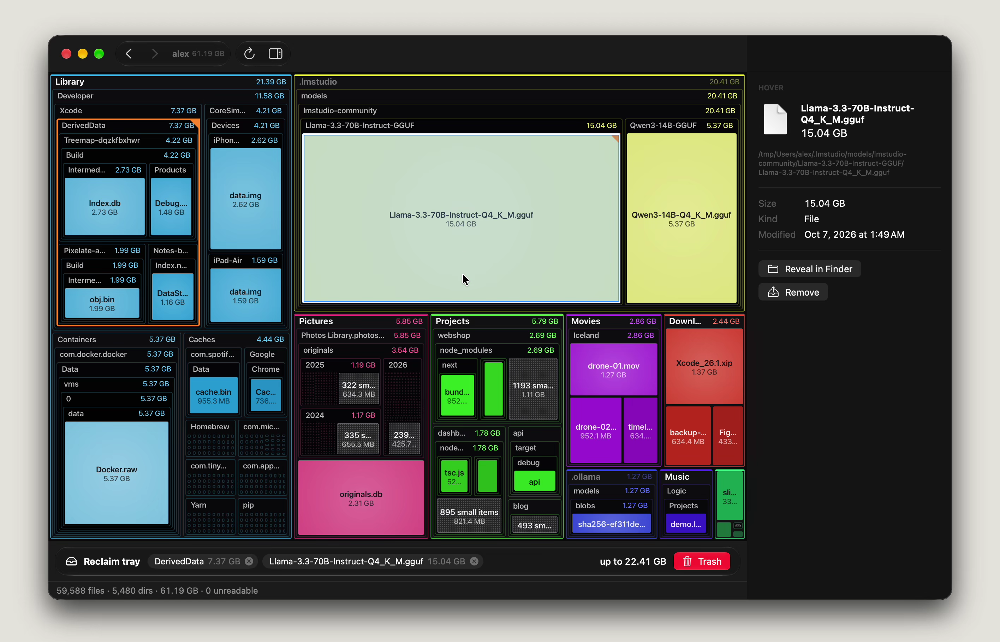
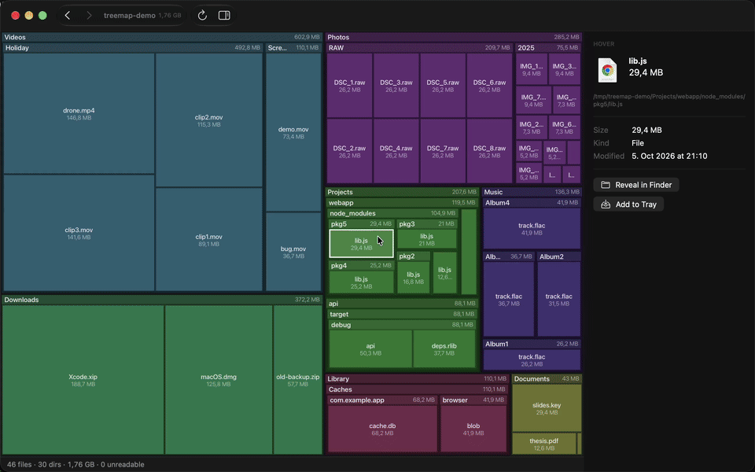

<p align="center">
  
</p>

<h1 align="center">Treemap</h1>

<p align="center">
  <strong>See what fills your disk. Then get it back.</strong>
</p>

---

Your disk is almost full, and you do not know why. Usually it is not one big file. It is
the things you forgot:

- **Local LLM models.** Ollama, LM Studio and Hugging Face each keep their own copies.
  80 GB of weights, and you use one model.
- **Caches.** Browsers, Xcode, Docker and package managers write them. Few clean up.
- **Leftovers.** Old installers, simulator images, phone backups, forgotten
  `node_modules`.

Finder hides most of these folders and does not show folder sizes. Treemap shows
everything in one picture. Find the big items in seconds, then delete them.



<p align="center">
  
  <br>
  <a href="assets/demo.mp4">Watch the full-quality video (MP4)</a>
</p>

## How it works

Each folder is a rectangle. Each file inside it is a smaller rectangle. The bigger the
rectangle, the more space it uses. You do not have to read a list: the large items are
the large blocks on the screen.

1. Open a disk or a folder.
2. Look for the big blocks. Click to see what they are, double-click to go deeper.
3. Collect the items you do not need in the **Reclaim tray**.
4. Move them to the Trash in one step.

## Features

- Fast parallel scan
- Shows hidden folders too
- Reclaim tray for batch delete
- Deletes to Trash only
- No double-counted APFS clones
- Live updates on file changes
- Quick Look and Finder integration
- Full keyboard control
- `treemap` command-line tool
- Native Mac app

## Install

Treemap needs **macOS 26 (Tahoe)** or later.

With [Homebrew](https://brew.sh):

```sh
brew tap marcboeker/treemap https://github.com/marcboeker/treemap
brew trust --cask marcboeker/treemap/treemap
brew install --cask treemap
```

Or download `Treemap-macos.zip` from the
[latest release](https://github.com/marcboeker/treemap/releases/latest), unzip it and
move `Treemap.app` to your Applications folder.

### Command line tool

To install it, open Treemap and choose **Treemap > Install Command Line Tool…**. Treemap
adds a `treemap` link in `/usr/local/bin`. If you cannot write to that folder, it uses
`~/.local/bin`. No administrator password is necessary. If the folder is not on your
`PATH`, Treemap shows the line to add to `~/.zshrc`.

```sh
treemap                  # open the current folder
treemap ~/Downloads      # open one folder
treemap ~/Library /opt   # open more than one folder
```

The link points into the app bundle, so it stays correct after app updates. If you move
`Treemap.app`, install the tool again.

## First run: expect some permission dialogs

macOS asks for permission the first time Treemap scans protected folders, such as
Desktop, Documents or external disks. This is normal. Treemap reads only file names and
sizes.

To see everything, turn on **Full Disk Access** in
**System Settings > Privacy & Security**, then restart Treemap. Without it, protected
folders show as hatched "Unreadable" blocks.

## Good to know

- Treemap never deletes a file permanently. Everything goes to the Trash first.
- The space you get back is shown as "up to X". APFS can share data between files and
  snapshots, so the real amount can be a little smaller.
- A scan stays on one disk. Other disks show as grey blocks; open them in their own tab.

## Under the hood

- **Scan:** parallel worker threads with `getattrlistbulk`, not one `stat` per file.
- **Render:** squarified layout, drawn with Metal instancing.
- **Watch:** FSEvents, rescans only changed folders.

## Build from source

You need Xcode 26 and [XcodeGen](https://github.com/yonaskolb/XcodeGen).

```sh
make app       # builds build/Treemap.app
make run       # build and launch
make test      # run the tests
```

For `make notarize`, set `NOTARY_IDENTITY` and `NOTARY_PROFILE` (and optionally `CODESIGN_IDENTITY`, `BUNDLE_ID`) in `.env`.

## License

MIT, see [LICENSE](LICENSE).
